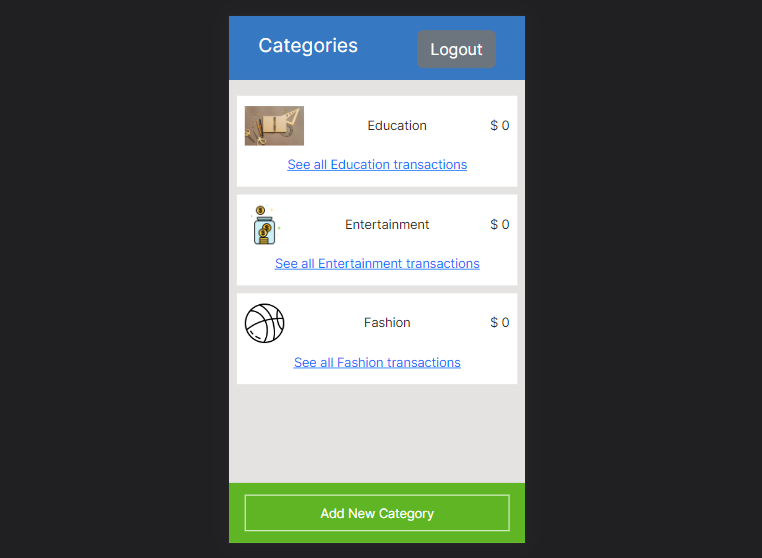

# BigBudget App

> The BigBudget App provides a convenient way for users to keep track of their expenses. The app allows for easy categorization of various transactions made. This offers a quick way to access the total amount that has been spent on all things and also on the various created categories.

- [Live Demo - Heroku](www.google.com)
- [Video Presentation](https://www.loom.com/share/a04dd415ac004a22b591fe7af8434e93)

## Quick Preview



## Entity Relationship Diagram
The Schema for the BigBudget App was designed based on the Entity Relationship Diagram (ERD) below.

> 

# Built with
- Ruby
- Ruby on Rails
- Rubocop
- Bootstrap
- Gems
  - Rspec
  - Capybara
  - Shoulder-matcher
  - Selenium-webdriver
  - Cancancan
  - Devise
  - FactoryBot
  - Faker
  - Mail-catcher

# Getting Started
Follow these steps below:

## Pre-requisites

```bash
- Ruby
- Rails
- PostgreSQL
```

## Setup
Clone the repo and run bundle install in the command line to install the dependencies

```bash
$ git clone git@github.com:BenjaminSemah/BigBudget.git
$ cd BigBudget
```

## Install gems with:

```bash
$ bundle install
```

## Install style linters with
```bash
$ npm install
```

## Run test on project with

```bash
$ rspec
  - this will run all the test cases
```

```bash
$ rspec spec/folder_name/name_of_test_file.rb
  - to run test cases individually
```

## Start rails server (puma)

```bash
$ rails server
```

Open [http://localhost:3000/](http://localhost:3000/) in your browser


## Author

👤 **Benjamin Semah**
- GitHub: [Benjamin Semah](https://github.com/BenjaminSemah)
- Twitter: [Benjamin Semah](https://twitter.com/BenjaminSemah)
- LinkedIn: [Benjamin Semah](https://www.linkedin.com/in/benjaminsemah/)

## 🤝 Contributions

Contributions, issues, and feature requests are welcome!

Feel free to check the [issues page](https://github.com/BenjaminSemah/BigBudget/issues).

## Show your support

Give a ⭐️ if you like this project!

## Acknowledgments

- Original design idea by [Snapscan - iOs design and branding](https://www.behance.net/gallery/19759151/Snapscan-iOs-design-and-branding?tracking_source=)


## 📝 License

This project is [MIT](https://github.com/BenjaminSemah/BigBudget/blob/dev/LICENSE) licensed.
